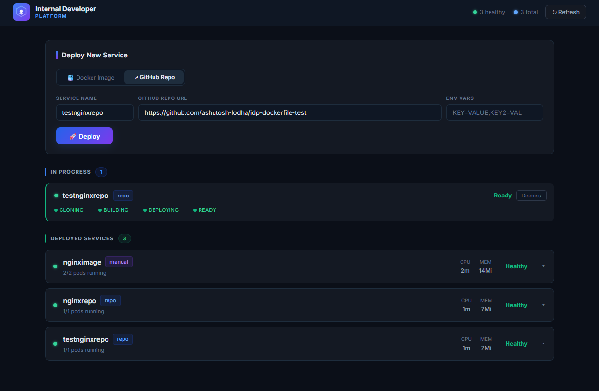
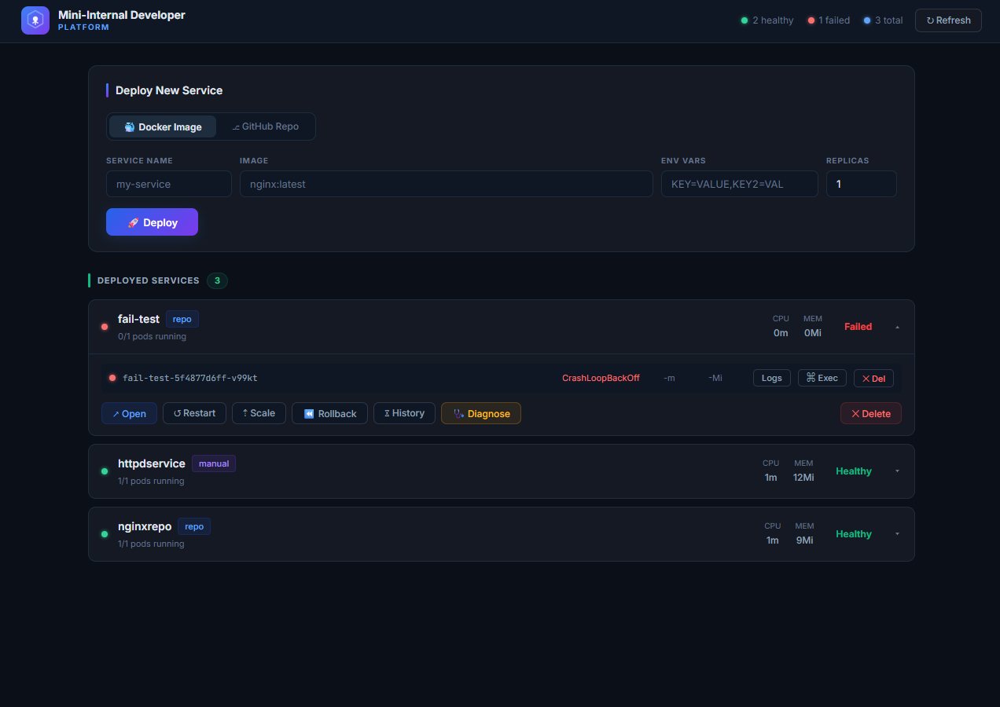
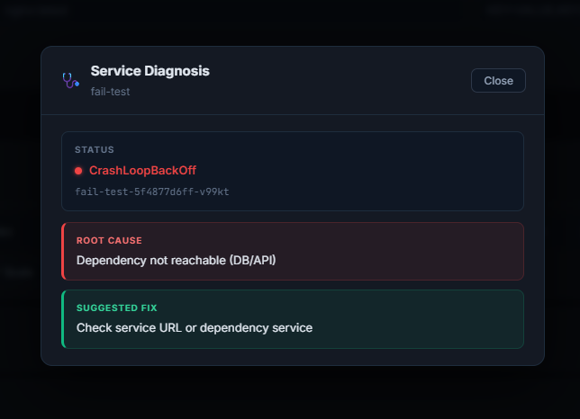

# Mini Internal Developer Platform (Mini-IDP)

A lightweight Internal Developer Platform (IDP) built on Kubernetes that enables service deployment, monitoring, and automated failure diagnosis.

---

## 🚀 Overview

Mini-IDP provides a unified interface to:

- 🚀 One-click service deployment (Helm-based)
- 🔄 GitHub webhook auto-deploy
- 📜 Live log streaming
- 🖥 Exec into running containers
- 📊 CPU & memory metrics
- ♻️ Rollback support
- 🩺 Automated failure diagnosis
- 🔐 Environment variables injection

The platform integrates Kubernetes, Helm, Docker, and GitHub into a single workflow using GUI.

---

## ✨ Core Features

### 1. Service Deployment

- Deploy services using Docker images  
- Supports web, API, and worker workloads  
- Uses Helm charts for Kubernetes deployment  
- Automatically loads images into Minikube  

#### Environment Variables Support

- Pass custom environment variables at deployment time  
- Injected into containers via Helm configuration  
- Useful for:
  - database URLs  
  - API keys  
  - runtime configs  

---

### 2. GitHub Auto Deployment

* Connect repository via webhook
* On push:

  * repo is cloned
  * Docker image is built
  * image is loaded into Minikube
  * service is upgraded via Helm

Supports:

* Docker projects
* Node.js (auto Dockerfile)
* Python (auto Dockerfile)

---

### 3. Logs & Exec Access

* Stream logs in real-time
* Open terminal inside running containers
* Debug issues directly

---

### 4. Metrics Monitoring

* CPU & memory usage via `kubectl top`
* Per-pod visibility

---

### 5. Service Lifecycle Management

* Restart services
* Scale replicas
* Rollback using Helm
* Delete services and pods

---

### 6. 🩺 Automated Failure Diagnosis

The diagnosis engine:

* Reads pod status + logs
* Matches known failure patterns
* Returns root cause + fix

| Condition           | Diagnosis                |
| ------------------- | ------------------------ |
| connection refused  | Dependency not reachable |
| module not found    | Build/Image issue        |
| permission denied   | Permission issue         |
| port already in use | Port conflict            |
| CrashLoopBackOff    | App crash                |
| ImagePullBackOff    | Image issue              |
| Pending             | Scheduling issue         |

---

## 🖥️ Screenshots

### Dashboard with Deployment Timeline



---

### Failure Simulation



---

### Diagnosis Output



---

## ⚙️ Setup (Windows Only)

---

## 📦 Prerequisites (Install if missing)

### 1. Install Docker Desktop 🐳

https://www.docker.com/products/docker-desktop/

👉 Start Docker before running setup

---

### 2. Install Minikube

```powershell id="c1l0c6"
choco install minikube
```

---

### 3. Install kubectl

```powershell id="f3yx0l"
choco install kubernetes-cli
```

---

### 4. Install Helm

```powershell id="3wq3sl"
choco install kubernetes-helm
```

---

### 5. Install Go

https://go.dev/dl/

---

### 6. Install Cloudflared ☁️

```powershell id="ykb1fq"
choco install cloudflared
```

OR manual:

```powershell id="kjr2m7"
winget install Cloudflare.cloudflared
```

---

## ▶️ Option 1 — Using Setup Script (Recommended)

Run from project root:

```powershell id="c40l4o"
Set-ExecutionPolicy -Scope Process -ExecutionPolicy Bypass
.\scripts\setup.ps1
```

This will:

* check dependencies
* start Minikube (if needed)
* create namespace
* start backend
* start tunnel
* start Cloudflare

---

## ▶️ Option 2 — Manual Setup

### 1. Start Minikube

```powershell id="93o1y7"
minikube start
```

---

### 2. Create Namespace

```powershell id="0v3jcc"
kubectl create namespace idp
```

---

### 3. Start Backend

```powershell id="t9x4tr"
go run cmd/server/main.go
```

---

### 4. Start Minikube Tunnel (Admin)

```powershell id="w0fqzm"
minikube tunnel
```

---

### 5. Start Cloudflare Tunnel

```powershell id="v1q7jl"
cloudflared tunnel --url http://localhost:8080
```

Example output:

```text id="9fzzow"
https://xxxxx.trycloudflare.com
```

---

## 🔗 GitHub Webhook Setup

Use:

```text id="pfm2n5"
https://xxxxx.trycloudflare.com/webhook/github
```

---

## 🧪 Demo Workflow

1. Deploy service
2. Introduce failure
3. Click **Diagnose**
4. View root cause + fix

---

## 🏗 Architecture

```text id="d1t7d8"
Frontend
   ↓
Go Backend
   ↓
Kubernetes (Minikube)
   ↓
Helm
   ↓
Containers

+ Cloudflare Tunnel → GitHub Webhooks
```

---

## ⚠️ Notes

* Run PowerShell as Administrator (for tunnel)
* Docker must be running
* Diagnosis is pattern-based
 
 ---